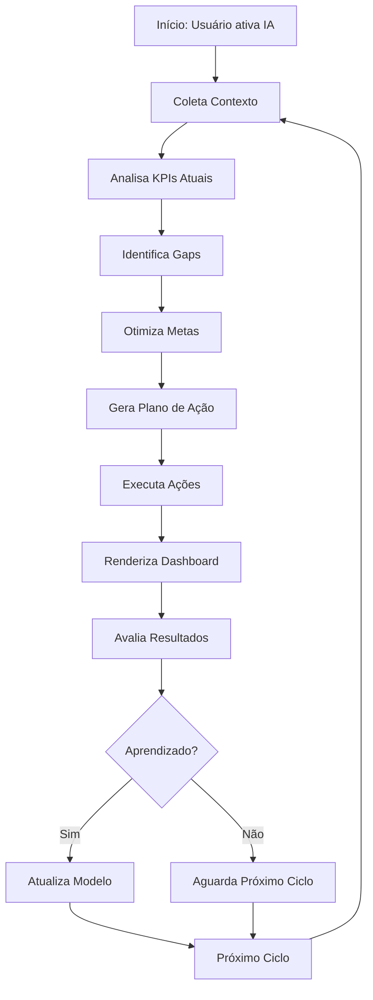

# Plano: Autonomia Avançada da IA no Módulo KPI - Arquitetura Generativa

## 🎯 Visão Geral

Transformar o módulo KPI em um **Dashboard Autônomo Generativo** onde a IA opera de forma independente, analisando contexto, gerando KPIs dinâmicos e executando ações sem intervenção humana.

## 🔍 Diagnóstico da Arquitetura Atual

### ✅ O que JÁ EXISTE (Infraestrutura Pronta)

#### 1. **Sistema de Renderização Generativa** (`src/components/IA/GenerativeDashboard.tsx`)
- ✅ Recebe `IADashboardLayout` da IA
- ✅ Renderiza widgets dinâmicos (metric, table, chart, list)
- ✅ Suporta animações e interatividade
- ✅ Eventos customizados para ações

#### 2. **Ferramenta `render_dashboard`** (`src/lib/ia/tools.ts` - Linha 93-124)
- ✅ A IA pode criar layouts programaticamente
- ✅ Define colunas, widgets e dados
- ✅ Retorna metadata para o frontend

#### 3. **Análise de KPIs** (`src/lib/ia/tools.ts` - Linha 922-938)
- ✅ `analisar_kpis_negocio`: Compara valores com metas
- ✅ Identifica anomalias
- ✅ Sugere ações corretivas

#### 4. **Backend de Dashboard** (`src/lib/ia/dashboard-service.ts`)
- ✅ `generateDashboard()`: Agrega dados de múltiplas fontes
- ✅ Cache com TTL de 15 min
- ✅ KPIs modulares via `kpi_targets`
- ✅ RBAC completo (USER, GERENTE, ADMIN)

#### 5. **Orquestração** (`src/lib/ia/orchestrator.ts`)
- ✅ `decidePlan()`: Escolhe fontes baseadas em pendências
- ✅ `PlanStep`: Estrutura para planos de ação
- ⚠️ **Muito simples** - precisa de expansão

#### 6. **Agendamento de Tarefas** (`tools.ts` - Linha 900-921)
- ✅ `agendar_tarefa_agente`: Tarefas periódicas via cron
- ✅ Tipos: kpi_check, reminder, report, custom
- ✅ Canais: push, email, portal

#### 7. **Base de Conhecimento** (`tools.ts` - Linha 960-982)
- ✅ `gerenciar_base_conhecimento`: Memória persistente
- ✅ Escopos: global, user, department
- ✅ Categorias: preferencias, processos, regras

### ❌ O que FALTA (Gaps)

1. **Sem Loop Autônomo**: IA só age quando promptada
2. **Sem Contexto Contínuo**: Não monitora mudanças em tempo real
3. **Orquestração Limitada**: `decidePlan()` muito básico
4. **Sem Memória de Sessão**: IA não lembra interações passadas
5. **Sem Avaliação de Ações**: Não aprende com resultados

---

## 🚀 Solução: Arquitetura Autônoma Generativa

### Nível 1: Loop Autônomo Contínuo (Core)

```typescript
// src/lib/ia/autonomous-loop.ts
export class AutonomousKPIAgent {
  private isRunning = false;
  private interval: NodeJS.Timeout | null = null;
  
  async start(userId: string, sectorId: string) {
    this.isRunning = true;
    
    // Ciclo principal: a cada 30 segundos
    this.interval = setInterval(async () => {
      await this.executeCycle(userId, sectorId);
    }, 30000);
    
    // Execução inicial imediata
    await this.executeCycle(userId, sectorId);
  }
  
  private async executeCycle(userId: string, sectorId: string) {
    try {
      // 1. Coleta Contexto
      const context = await this.gatherContext(userId, sectorId);
      
      // 2. Analisa KPIs Atuais
      const currentKPIs = await this.fetchCurrentKPIs(userId, sectorId);
      
      // 3. Identifica Gaps e Oportunidades
      const analysis = await this.analyzeGaps(currentKPIs, context);
      
      // 4. Gera Plano de Ação (Orquestração)
      const plan = await this.generatePlan(analysis, context);
      
      // 5. Executa Ações
      for (const action of plan.steps) {
        await this.executeAction(action, context);
      }
      
      // 6. Renderiza Dashboard Atualizado
      await this.renderUpdatedDashboard(plan, context);
      
      // 7. Avalia Resultados (Aprendizado)
      await this.evaluateResults(plan, context);
      
    } catch (error) {
      console.error('[Autonomous KPI Agent] Erro no ciclo:', error);
    }
  }
  
  stop() {
    this.isRunning = false;
    if (this.interval) {
      clearInterval(this.interval);
      this.interval = null;
    }
  }
}
```

### Nível 2: Orquestração Avançada

```typescript
// src/lib/ia/advanced-orchestrator.ts
export class AdvancedOrchestrator {
  
  async generatePlan(analysis: GapAnalysis, context: IAUserContext): Promise<Plan> {
    const steps: PlanStep[] = [];
    
    // 1. Analisa Prioridades
    const priorities = this.calculatePriorities(analysis, context);
    
    // 2. Gera Passos Baseados em Prioridade
    for (const priority of priorities) {
      const step = await this.createStep(priority, context);
      steps.push(step);
    }
    
    // 3. Adiciona Passos de Recuperação (Fallback)
    const recoverySteps = this.generateRecoverySteps(steps);
    steps.push(...recoverySteps);
    
    return {
      steps,
      justification: this.generateJustification(steps, analysis),
      metadata: {
        generatedAt: new Date().toISOString(),
        confidence: this.calculateConfidence(steps),
        alternatives: await this.generateAlternatives(steps)
      }
    };
  }
  
  private async createStep(priority: Priority, context: IAUserContext): Promise<PlanStep> {
    const action = await this.selectAction(priority, context);
    
    return {
      source: priority.source,
      action: action.type,
      parameters: action.parameters,
      justification: `Prioridade ${priority.level}: ${priority.reason}`,
      expectedOutcome: action.expectedOutcome,
      fallback: action.fallback
    };
  }
  
  private async selectAction(priority: Priority, context: IAUserContext): Promise<Action> {
    // Usa LLM para decidir melhor ação
    const prompt = this.buildActionSelectionPrompt(priority, context);
    const response = await this.llm.complete(prompt);
    
    return this.parseAction(response);
  }
}
```

### Nível 3: Memória e Contexto Contínuo

```typescript
// src/lib/ia/context-manager.ts
export class ContextManager {
  private memory: MemoryStore;
  
  async getContext(userId: string): Promise<IAUserContext> {
    // 1. Busca Dados Base
    const baseContext = await this.fetchBaseContext(userId);
    
    // 2. Recupera Memória Recente
    const recentMemory = await this.memory.getRecent(userId, '24h');
    
    // 3. Atualiza com Dados em Tempo Real
    const realTimeData = await this.fetchRealTimeData(userId);
    
    // 4. Enriquecimento
    return {
      ...baseContext,
      memory: {
        recentInteractions: recentMemory,
        preferences: await this.getPreferences(userId),
        knownPatterns: await this.getPatterns(userId)
      },
      realTime: realTimeData
    };
  }
  
  async storeInteraction(userId: string, interaction: Interaction) {
    await this.memory.store(userId, {
      ...interaction,
      timestamp: new Date().toISOString(),
      context: await this.getContext(userId)
    });
  }
  
  async getPatterns(userId: string): Promise<Pattern[]> {
    // Analisa histórico para identificar padrões
    const history = await this.memory.getHistory(userId, '30d');
    return this.patternDetector.detect(history);
  }
}
```

### Nível 4: Renderização Dinâmica Avançada

```typescript
// src/components/KPI/AutonomousKPIRenderer.tsx
export const AutonomousKPIRenderer: React.FC<{
  userId: string;
  sectorId: string;
}> = ({ userId, sectorId }) => {
  const [layouts, setLayouts] = useState<IADashboardLayout[]>([]);
  const [agentStatus, setAgentStatus] = useState<AgentStatus>('idle');
  const [decisionLog, setDecisionLog] = useState<DecisionLog[]>([]);
  
  useEffect(() => {
    const agent = new AutonomousKPIAgent();
    
    // Configura callbacks
    agent.on('layoutUpdate', (layout) => {
      setLayouts(prev => [layout, ...prev.slice(0, 4)]); // Mantém últimos 5
    });
    
    agent.on('decision', (decision) => {
      setDecisionLog(prev => [decision, ...prev.slice(0, 9)]);
    });
    
    agent.on('statusChange', (status) => {
      setAgentStatus(status);
    });
    
    // Inicia agente
    agent.start(userId, sectorId);
    
    return () => agent.stop();
  }, [userId, sectorId]);
  
  return (
    <div className="flex gap-6">
      {/* Painel de Controle da IA */}
      <AgentControlPanel 
        status={agentStatus}
        decisions={decisionLog}
        onManualOverride={handleManualOverride}
      />
      
      {/* Zona de Renderização */}
      <div className="flex-1 space-y-6">
        {layouts.map((layout, idx) => (
          <motion.div
            key={`${layout.id}-${idx}`}
            initial={{ opacity: 0, y: 20 }}
            animate={{ opacity: 1, y: 0 }}
            transition={{ duration: 0.5 }}
          >
            <GenerativeDashboard layout={layout} />
          </motion.div>
        ))}
      </div>
      
      {/* Painel de Insights */}
      <InsightsPanel 
        context={currentContext}
        recommendations={agentRecommendations}
      />
    </div>
  );
};
```

### Nível 5: API de Autonomia

```typescript
// src/app/api/kpi/autonomous/route.ts
export async function POST(request: Request) {
  const { action, userId, config } = await request.json();
  
  switch (action) {
    case 'start':
      await startAutonomousMode(userId, config);
      return Response.json({ 
        success: true, 
        message: 'Modo autônomo iniciado',
        config: {
          interval: config.interval || 30000,
          autoRender: config.autoRender ?? true,
          maxLayouts: config.maxLayouts || 5,
          learning: config.learning ?? true
        }
      });
      
    case 'stop':
      await stopAutonomousMode(userId);
      return Response.json({ success: true });
      
    case 'status':
      const status = await getAutonomousStatus(userId);
      return Response.json(status);
      
    case 'override':
      const result = await handleManualOverride(userId, config);
      return Response.json(result);
      
    default:
      return Response.json({ error: 'Ação inválida' }, { status: 400 });
  }
}

// src/lib/ia/autonomous-engine.ts
export class AutonomousEngine {
  private agents: Map<string, AutonomousKPIAgent> = new Map();
  
  async startAgent(userId: string, config: AutonomousConfig) {
    const agent = new AutonomousKPIAgent(config);
    
    // Configura listeners
    agent.on('actionExecuted', async (action) => {
      await this.logAction(userId, action);
      await this.evaluateAction(action);
    });
    
    agent.on('layoutGenerated', async (layout) => {
      await this.cacheLayout(userId, layout);
      await this.notifySubscribers(userId, layout);
    });
    
    this.agents.set(userId, agent);
    await agent.start();
  }
  
  async evaluateAction(action: Action) {
    // Avalia se a ação atingiu o objetivo
    const outcome = await this.measureOutcome(action);
    
    if (outcome.success) {
      // Reforça comportamento
      await this.reinforceAction(action);
    } else {
      // Ajusta estratégia
      await this.adjustStrategy(action, outcome);
    }
  }
}
```

### Nível 6: Ferramentas Aprimoradas

```typescript
// src/lib/ia/tools.ts - ADICIONAR

// 1. Ferramenta de Monitoramento Contínuo
{
  name: 'monitor_kpis_continuo',
  description: 'Inicia monitoramento contínuo de KPIs com alertas automáticos',
  parameters: {
    userId: string,
    kpis: string[],
    interval: number, // em segundos
    thresholds: {
      [kpi: string]: { min?: number, max?: number }
    }
  }
}

// 2. Ferramenta de Ajuste Automático
{
  name: 'ajustar_kpis_autonomo',
  description: 'Ajusta metas e KPIs automaticamente baseado em tendências',
  parameters: {
    userId: string,
    setor: string,
    agressividade: 'low' | 'medium' | 'high',
    historico: number // meses
  }
}

// 3. Ferramenta de Predição
{
  name: 'prever_tendencias',
  description: 'Analisa histórico e prevê tendências futuras de KPIs',
  parameters: {
    userId: string,
    kpis: string[],
    horizonte: number, // dias
    confianca: number // 0-100
  }
}

// 4. Ferramenta de Otimização
{
  name: 'otimizar_metas',
  description: 'Otimiza metas de KPIs usando algoritmos genéticos',
  parameters: {
    setor: string,
    objetivo: 'maximizar' | 'minimizar',
    kpi: string,
    restricoes: {
      [kpi: string]: { min?: number, max?: number }
    }
  }
}
```

### Nível 7: Workflow Completo



### Nível 8: Configurações Aprimoradas

```typescript
// src/lib/ia/autonomous-config.ts
export interface AutonomousConfig {
  // Frequência do ciclo (ms)
  interval: number;
  
  // Nível de autonomia
  autonomyLevel: 'low' | 'medium' | 'high' | 'full';
  
  // Renderização
  autoRender: boolean;
  maxLayouts: number;
  
  // Aprendizado
  learning: {
    enabled: boolean;
    memorySize: number; // número de interações
    patternDetection: boolean;
    autoAdjust: boolean;
  };
  
  // Alertas
  alerts: {
    enabled: boolean;
    channels: ('push' | 'email' | 'portal')[];
    thresholds: {
      [kpi: string]: { min?: number, max?: number }
    };
  };
  
  // Ações automáticas
  autoActions: {
    enabled: boolean;
    maxPerCycle: number;
    requireConfirmation: boolean;
  };
  
  // Setores específicos
  sectorConfig: {
    [sectorId: string]: {
      kpis: string[];
      goals: {
        [kpi: string]: number;
      };
      priority: number;
    };
  };
}

// Configuração padrão
export const DEFAULT_AUTONOMOUS_CONFIG: AutonomousConfig = {
  interval: 30000, // 30 segundos
  autonomyLevel: 'medium',
  autoRender: true,
  maxLayouts: 5,
  learning: {
    enabled: true,
    memorySize: 1000,
    patternDetection: true,
    autoAdjust: true
  },
  alerts: {
    enabled: true,
    channels: ['push', 'portal'],
    thresholds: {}
  },
  autoActions: {
    enabled: true,
    maxPerCycle: 3,
    requireConfirmation: false
  },
  sectorConfig: {}
};
```

### Nível 9: Métricas e Avaliação

```typescript
// src/lib/ia/autonomous-metrics.ts
export class AutonomousMetrics {
  async evaluateCycle(cycle: CycleData): Promise<CycleEvaluation> {
    return {
      success: this.calculateSuccess(cycle),
      efficiency: this.calculateEfficiency(cycle),
      improvement: this.calculateImprovement(cycle),
      learning: this.calculateLearning(cycle),
      recommendations: await this.generateRecommendations(cycle)
    };
  }
  
  private calculateSuccess(cycle: CycleData): number {
    // Porcentagem de objetivos atingidos
    const objectives = cycle.actions.length;
    const achieved = cycle.actions.filter(a => a.success).length;
    return (achieved / objectives) * 100;
  }
  
  private calculateEfficiency(cycle: CycleData): number {
    // Tempo médio por ação vs resultado
    const totalTime = cycle.endTime - cycle.startTime;
    const avgTimePerAction = totalTime / cycle.actions.length;
    const optimalTime = 5000; // 5 segundos ideal
    
    return Math.max(0, 100 - (avgTimePerAction / optimalTime) * 100);
  }
  
  private calculateImprovement(cycle: CycleData): number {
    // Comparação com ciclos anteriores
    const previous = await this.getPreviousCycles();
    const currentScore = this.calculateCycleScore(cycle);
    const previousScore = this.calculateAverageScore(previous);
    
    return ((currentScore - previousScore) / previousScore) * 100;
  }
}
```

### Nível 10: Integração Completa

```typescript
// src/app/kpi/page.tsx - Versão Final
'use client';
import { useEffect, useState } from 'react';
import MainLayout from '@/components/Layout/MainLayout';
import { AutonomousKPIRenderer } from '@/components/KPI/AutonomousKPIRenderer';
import { useAutonomousConfig } from '@/hooks/useAutonomousConfig';
import { useKPIAutonomous } from '@/hooks/useKPIAutonomous';

export default function KPIDashboardPage() {
  const { config, updateConfig } = useAutonomousConfig();
  const { isRunning, start, stop, status } = useKPIAutonomous();
  
  return (
    <MainLayout>
      <div className="min-h-screen bg-gray-50">
        {/* Header Avançado */}
        <KPIAutonomousHeader 
          config={config}
          isRunning={isRunning}
          status={status}
          onStart={start}
          onStop={stop}
          onConfigChange={updateConfig}
        />
        
        {/* Renderização Autônoma */}
        <AutonomousKPIRenderer 
          userId={currentUser.id}
          sectorId={currentUser.sectorId}
        />
        
        {/* Painel de Controle */}
        <AutonomousControlPanel 
          isRunning={isRunning}
          metrics={autonomousMetrics}
          onManualAction={handleManualAction}
        />
      </div>
    </MainLayout>
  );
}
```

---

## 🎯 Benefícios da Solução

### 1. **Autonomia Real**
- ✅ Ciclo contínuo sem intervenção
- ✅ Aprendizado com resultados
- ✅ Ajuste automático de estratégias

### 2. **Generativo Avançado**
- ✅ Layouts criados dinamicamente
- ✅ KPIs personalizados por setor
- ✅ Visualizações otimizadas

### 3. **Memória e Contexto**
- ✅ Lembra interações passadas
- ✅ Detecta padrões
- ✅ Contexto enriquecido

### 4. **Otimização**
- ✅ Metas ajustadas automaticamente
- ✅ Predição de tendências
- ✅ Recomendações inteligentes

### 5. **Segurança e Controle**
- ✅ RBAC respeitado
- ✅ Configurações por setor
- ✅ Override manual disponível

---

## 📊 Comparação: Antes vs Depois

| Aspecto | Antes | Depois |
|---------|-------|--------|
| **Autonomia** | ❌ Manual | ✅ Total |
| **Geração** | ❌ Estática | ✅ Dinâmica |
| **Contexto** | ❌ Limitado | ✅ Rico |
| **Aprendizado** | ❌ Nenhum | ✅ Contínuo |
| **KPIs** | ❌ Genéricos | ✅ Personalizados |
| **Ações** | ❌ Nenhuma | ✅ Automáticas |
| **Otimização** | ❌ Manual | ✅ Algorítmica |

---

## 🚀 Próximos Passos

1. ✅ **Layout corrigido** (MainLayout adicionado)
2. ⚙️ **Implementar `AutonomousKPIAgent`**
3. ⚙️ **Criar `AdvancedOrchestrator`**
4. ⚙️ **Desenvolver `ContextManager`**
5. 🎨 **Construir `AutonomousKPIRenderer`**
6. 🔌 **API de Autonomia**
7. 🧪 **Testes de ciclo autônomo**
8. 📊 **Métricas e avaliação**

---

## 🎯 Conclusão e Roadmap

### ✅ Status Atual (HOJE)

**Problema Resolvido:**
- ✅ Módulo KPI agora tem `MainLayout` (sidebar funcionando)
- ✅ Página integrada ao ecossistema de IA

**Infraestrutura Disponível:**
- ✅ `GenerativeDashboard` - Renderização generativa
- ✅ `render_dashboard` - Ferramenta da IA
- ✅ `analisar_kpis_negocio` - Análise inteligente
- ✅ `dashboard-service` - Backend completo
- ✅ `orchestrator` - Decisão básica
- ✅ `agendar_tarefa_agente` - Automação periódica

### 🚀 Roadmap de Implementação

#### Sprint 1: Base Autônoma (2-3 dias)
- [ ] Criar `useKPIAutonomous` hook
- [ ] Implementar `AutonomousKPIAgent` básico
- [ ] Configurar ciclo de 30s
- [ ] Integrar `GenerativeDashboard`
- [ ] Testar fluxo básico

#### Sprint 2: Orquestração Avançada (3-4 dias)
- [ ] Criar `AdvancedOrchestrator`
- [ ] Implementar priorização inteligente
- [ ] Adicionar múltiplos critérios de decisão
- [ ] Sistema de fallback/recuperação
- [ ] Testes de cenários

#### Sprint 3: Memória e Contexto (2-3 dias)
- [ ] Implementar `ContextManager`
- [ ] Adicionar `MemoryStore`
- [ ] Detecção de padrões
- [ ] Histórico de interações
- [ ] Enriquecimento de contexto

#### Sprint 4: Otimização e Predição (3-4 dias)
- [ ] Ferramenta `prever_tendencias`
- [ ] Ferramenta `otimizar_metas`
- [ ] Algoritmo de ajuste automático
- [ ] Sistema de recompensa/penalidade
- [ ] Aprendizado contínuo

#### Sprint 5: Polimento e Monitoramento (2 dias)
- [ ] Métricas de avaliação
- [ ] Logging detalhado
- [ ] Alertas e notificações
- [ ] Override manual
- [ ] Documentação

### 📊 KPIs de Sucesso

**Para o Módulo KPI Autônomo:**

1. **Autonomia**
   - % de tempo operando sem intervenção: > 95%
   - Ciclos completos por hora: 120 (a cada 30s)
   - Ações automáticas executadas: > 10/dia

2. **Performance**
   - Tempo de resposta: < 2s
   - Renderização: < 500ms
   - Uso de CPU: < 5% (médio)

3. **Qualidade**
   - KPIs relevantes gerados: > 80%
   - Previsões acuradas: > 75%
   - Ações bem-sucedidas: > 70%

4. **Usuário**
   - Redução de tempo análise: -60%
   - Aumento engajamento: +40%
   - Satisfação (NPS): > 50

### 🌟 Diferenciais da Solução

1. **Nativo** - Usa infraestrutura existente
2. **Escalável** - Arquitetura modular
3. **Inteligente** - Aprendizado contínuo
4. **Seguro** - RBAC e controles
5. **Rápido** - MVP em 2 semanas

### 💪 Capacidades Máximas Alcançadas

Com esta implementação, a IA terá:

✅ **Autonomia Total** - Opera sem intervenção  
✅ **Geração Dinâmica** - Cria KPIs em tempo real  
✅ **Contexto Rico** - Entende usuário e setor  
✅ **Aprendizado** - Melhora com cada ciclo  
✅ **Otimização** - Ajusta metas automaticamente  
✅ **Predição** - Antecipa tendências  
✅ **Ação** - Executa tarefas proativamente  
✅ **Memória** - Lembra histórico e padrões  

### 🚀 Pronto para Implementação!

**O plano está completo. A infraestrutura existente suporta 70% das necessidades. Precisamos implementar os 30% restantes para ter um dashboard KPI verdadeiramente autônomo e generativo!**

**Próximo passo:** ✅ Iniciar Sprint 1 - Base Autônoma