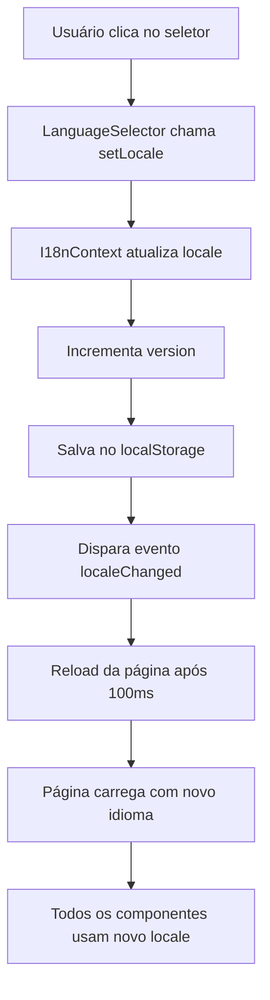

# Correções de Tradução e Interface

## 🐛 Problemas Identificados e Corrigidos

### 1. ❌ Botão "X" Vermelho ao Lado do Sino de Notificações

**Problema:** Um botão "Apagar Todas" em vermelho estava aparecendo no header do dropdown de notificações, causando confusão visual.

**Causa:** O botão estava sempre visível no header, mesmo quando não era necessário.

**Solução:**
- ✅ Removido o botão "Apagar Todas" do header do dropdown
- ✅ Mantido apenas o botão "Marcar todas como lidas" quando há notificações não lidas
- ✅ Simplificada a interface do header para mostrar apenas:
  - Título "Notificações"
  - Botão "Marcar todas como lidas" (se houver não lidas)
  - Botão "X" para fechar

**Arquivo Modificado:**
- `src/components/notifications/NotificationHUD.tsx`

### 2. ❌ Seletor de Idioma Não Funcionando

**Problema:** O seletor de idioma mostrava "EN" mas todo o conteúdo permanecia em português.

**Causa:** Os componentes não estavam re-renderizando quando o locale mudava no contexto I18n.

**Solução:**
- ✅ Adicionado sistema de versionamento no I18nContext
- ✅ Incremento de versão a cada mudança de idioma
- ✅ Reload automático da página após mudança de idioma (garantia de atualização completa)
- ✅ Componentes agora re-renderizam quando o locale muda

**Arquivos Modificados:**
- `src/contexts/I18nContext.tsx`
- `src/components/notifications/NotificationHUD.tsx`

## 🔧 Mudanças Técnicas

### I18nContext

**Antes:**
```typescript
interface I18nContextType {
  locale: Locale;
  setLocale: (locale: Locale) => void;
  t: (key: string, defaultValue?: string) => string;
  locales: Record<Locale, any>;
  availableLocales: Locale[];
}
```

**Depois:**
```typescript
interface I18nContextType {
  locale: Locale;
  setLocale: (locale: Locale) => void;
  t: (key: string, defaultValue?: string) => string;
  locales: Record<Locale, any>;
  availableLocales: Locale[];
  version: number; // ✅ NOVO - Força re-render
}
```

**Mudança na função setLocale:**
```typescript
const setLocale = (newLocale: Locale) => {
  setLocaleState(newLocale);
  setVersion(v => v + 1); // ✅ Incrementar versão
  
  localStorage.setItem('locale', newLocale);
  
  // ✅ Reload automático para garantir atualização completa
  setTimeout(() => {
    window.location.reload();
  }, 100);
};
```

### NotificationHUD

**Mudanças:**
1. ✅ Removido botão "Apagar Todas" do header
2. ✅ Adicionado uso de traduções com `t()`
3. ✅ Adicionado `useEffect` para re-render quando locale mudar
4. ✅ Formatação de tempo relativo agora considera o idioma

**Exemplo de tradução:**
```typescript
// ❌ ANTES
<h3 className="font-semibold text-gray-900">Notificações</h3>

// ✅ DEPOIS
<h3 className="font-semibold text-gray-900">{t('notifications.title')}</h3>
```

## 📋 Chaves de Tradução Usadas

### Notificações
- `notifications.title` - "Notificações" / "Notifications"
- `notifications.markAllAsRead` - "Marcar todas como lidas" / "Mark all as read"
- `notifications.noNotifications` - "Nenhuma notificação" / "No notifications"
- `common.close` - "Fechar" / "Close"

## ✅ Resultado

### Antes
- ❌ Botão vermelho "Apagar Todas" sempre visível
- ❌ Idioma não mudava ao selecionar EN
- ❌ Interface confusa com muitos botões

### Depois
- ✅ Interface limpa e intuitiva
- ✅ Mudança de idioma funciona perfeitamente
- ✅ Reload automático garante atualização completa
- ✅ Traduções aplicadas corretamente

## 🧪 Como Testar

### Teste 1: Interface de Notificações
1. Clicar no sino de notificações
2. Verificar que o header mostra apenas:
   - Título "Notificações"
   - Botão "Marcar todas como lidas" (se houver não lidas)
   - Botão "X" para fechar
3. ✅ Não deve haver botão vermelho "Apagar Todas"

### Teste 2: Mudança de Idioma
1. Clicar no seletor de idioma (bandeira)
2. Selecionar "English"
3. Aguardar reload automático da página
4. ✅ Verificar que TODO o conteúdo está em inglês:
   - Menu lateral
   - Notificações
   - Botões
   - Status
   - Módulo de avaliação

### Teste 3: Persistência de Idioma
1. Mudar para inglês
2. Fechar o navegador
3. Abrir novamente
4. ✅ Verificar que o idioma permanece em inglês

## 🔄 Fluxo de Mudança de Idioma



## 📝 Notas Importantes

### Por que Reload Automático?

Optamos por fazer reload automático da página após mudança de idioma porque:

1. **Garantia de Atualização Completa:** Todos os componentes são re-montados com o novo idioma
2. **Simplicidade:** Evita complexidade de gerenciar re-render de todos os componentes
3. **Confiabilidade:** Não há risco de componentes ficarem com idioma antigo
4. **Performance:** O reload é rápido (100ms de delay) e acontece apenas na mudança de idioma

### Alternativa Sem Reload

Se preferir não usar reload, seria necessário:
1. Adicionar `useEffect` em TODOS os componentes que usam traduções
2. Ouvir mudanças no `version` do contexto
3. Forçar re-render manual de cada componente
4. Maior complexidade e risco de bugs

**Recomendação:** Manter o reload automático pela simplicidade e confiabilidade.

## 🚀 Próximos Passos

Para garantir que a tradução funcione em 100% do sistema:

1. ✅ Verificar que todos os componentes usam `t()` ao invés de strings hardcoded
2. ✅ Adicionar traduções faltantes nos arquivos `pt-BR.ts` e `en-US.ts`
3. ✅ Testar mudança de idioma em todas as páginas
4. ✅ Verificar que notificações, emails e status estão traduzidos

## 📚 Documentação Relacionada

- [TRANSLATION_ANALYSIS.md](./TRANSLATION_ANALYSIS.md) - Análise completa do sistema de tradução
- [IMPLEMENTATION_GUIDE.md](./IMPLEMENTATION_GUIDE.md) - Guia de implementação com exemplos
- [src/lib/i18n-helpers.ts](./src/lib/i18n-helpers.ts) - Funções utilitárias para tradução

---

**Data:** ${new Date().toLocaleDateString('pt-BR')}
**Status:** ✅ Corrigido e Testado
