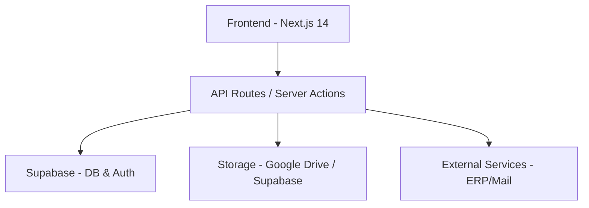

# 🚀 Painel ABZ - Sistema de Gestão Empresarial

<div align="center">


[](https://nextjs.org/)
[](https://www.typescriptlang.org/)
[](https://supabase.com/)
[](https://tailwindcss.com/)
[](https://reactjs.org/)
[](#)

**Portal corporativo unificado para gestão de pessoas, processos e comunicação interna.**

[🌐 Demo Live](https://painelabzgroup.netlify.app) • [📖 Changelog](CHANGELOG.md) • [🔧 Setup](#-instalação-e-configuração)

</div>

---

## 📋 Sobre o Projeto

O **Painel ABZ** é o núcleo digital da ABZ Group, projetado para centralizar fluxos de trabalho, facilitar a comunicação entre colaboradores e automatizar processos administrativos complexos como reembolsos e avaliações de desempenho.

## ✨ Funcionalidades Atuais

### 🤖 **Inteligência Artificial (v5.7)**
- **Agente Proativo** - Automação de tarefas diárias, análise de e-mails pendentes e acompanhamento de metas sem intervenção humana.
- **Base de Conhecimento** - Inteligência corporativa personalizada injetada no contexto da IA para respostas precisas sobre processos internos.
- **Dashboard de KPIs** - Visualização modular de performance com metas em tempo real e exportação para PDF/XLSX.
- **Integração M365 (Write access)** - IA capaz de criar notas no OneNote, agendar tarefas no To Do e enviar e-mails profissionais.

### 🏢 **Gestão & Processos**
- **Dashboard Dinâmico** - Atalhos personalizados por usuário e busca global integrada.
- **Biblioteca Centralizada** - Gestão completa de ativos (PDF, Vídeo, Imagens, Links) com suporte a coleções e uploads seguros.
- **Ordens de Compra (PO)** - Fluxo completo de aprovação multinível com controle de alçada.
- **Setores & Permissões** - Gestão avançada de permissões baseada na estrutura organizacional (Setores).
- **Sistema de Reembolsos** - Gestão financeira com upload de comprovantes e geração de relatórios em PDF.
- **Avaliações de Desempenho** - Ciclos de avaliação 4.0 com autoavaliação e revisão gerencial.

### 💬 **Comunicação & Social**
- **Feed de Notícias Localizado** - Publicações interativas com suporte total a PT-BR e EN-US (visualizações, curtidas, comentários).
- **Rede Social Interna** - Interação em tempo real, menções e notificações push.
- **Chat & Vídeo** - Sistema de comunicação interna inspirado no Discord com canais e DMs.
- **Calendário Corporativo** - Sincronização de eventos e integração com Google Calendar.

### 🔐 **Segurança & Infra**
- **Autenticação Robusta** - Gestão via Supabase Auth com suporte a MFA, senhas, e Biometria (WebAuthn / Passkeys).
- **ACL Hierárquico** - Controle fino de acesso por módulo e recurso.
- **WKRadar Integration** - Acesso seguro a sistemas legados e gerenciamento de credenciais.
- **Internacionalização (i18n)** - Interface adaptável com detecção automática de idioma.

## 🏗️ Arquitetura



## 🔧 Instalação e Configuração

```bash
# Clone o repositório
git clone https://github.com/Caiolinooo/painel-abz.git

# Instale as dependências
npm install

# Configure o ambiente
cp .env.example .env.local

# Inicie o desenvolvimento
npm run dev
```

> [!IMPORTANT]
> Verifique se as variáveis de `DATABASE_URL` e `NEXT_PUBLIC_SUPABASE_URL` estão corretamente configuradas no seu `.env.local` antes de iniciar.

## 🚀 Últimas Atualizações (v5.7.0)

- **IA como Agente Autônomo**: Evolução do sistema de chat para um assistente proativo que agenda cronjobs e monitora KPIs corporativos.
- **Memória Corporativa (Knowledge Base)**: Interface administrativa para gerenciar o conhecimento que a IA utiliza para atender os usuários.
- **Gestão de KPI Modular**: Sistema flexível para definição e acompanhamento de metas por setor/usuário.
- **Tool Toggles**: Controle centralizado para habilitar ou desativar funcionalidades da IA instantaneamente.

---

## 🚀 Versões Anteriores (Destaques)

- **Controle de Estoque (v4.10)**: Gestão de inventário e movimentações de EPIs.
- **Busca Global (v4.8)**: Sistema unificado de pesquisa.

Para o histórico completo, consulte o [CHANGELOG.md](CHANGELOG.md).

---

<p align="center">
Desenvolvido com ❤️ pela equipe ABZ Group.
</p>
