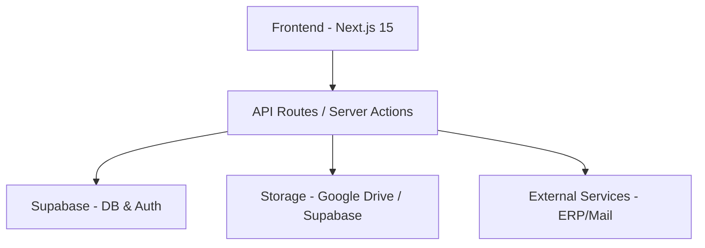

# Painel ABZ - Sistema de Gestão Empresarial

<div align="center">


[](https://nextjs.org/)
[](https://www.typescriptlang.org/)
[](https://supabase.com/)
[](https://tailwindcss.com/)
[](https://reactjs.org/)
[](#)

**Portal corporativo unificado para gestao de pessoas, processos, comunicacao interna e compliance trabalhista.**

[](CHANGELOG.md)

</div>

---

## Sobre o Projeto

O **Painel ABZ** e o nucleo digital da ABZ Group, projetado para centralizar fluxos de trabalho, facilitar a comunicacao entre colaboradores e automatizar processos administrativos complexos. O sistema abrange desde gestao financeira e avaliacoes de desempenho ate compliance governamental (e-Social) e gestao offshore de tripulantes.

---

## Arquitetura do Sistema

```
                    ┌─────────────────────────────────────┐
                    │        Next.js 15 App Router         │
                    │  (React 18 + TypeScript 5)           │
                    └──────────┬──────────────────────────┘
                               │
                    ┌──────────┴──────────────────────────┐
                    │          API Routes Layer             │
                    │  /api/auth/*  /api/admin/*  /api/*   │
                    └──────────┬──────────────────────────┘
                               │
          ┌────────────────────┼────────────────────┐
          │                    │                    │
          ▼                    ▼                    ▼
┌──────────────────┐  ┌──────────────┐  ┌──────────────────┐
│   Supabase DB     │  │  Supabase    │  │  External APIs    │
│   (PostgreSQL)    │  │  Auth/RLS    │  │  - MIO (ERP)     │
│   + 50+ tables   │  │  Storage     │  │  - e-Social (SOAP)│
│   + Views/Funcs  │  │  Realtime    │  │  - PoliWeb        │
└──────────────────┘  └──────────────┘  │  - Microsoft 365  │
                                        │  - LiveKit (Voice)│
                                        └──────────────────┘
```

### Stack Tecnologica
- **Frontend**: Next.js 15 (App Router), React 18, TypeScript 5, Tailwind CSS 3
- **Database**: Supabase (PostgreSQL) com RLS e Storage
- **Auth**: Supabase Auth + JWT customizado + WebAuthn/Passkeys
- **UI**: Radix UI, Framer Motion, React Icons, Recharts
- **OCR**: Tesseract.js + pdf-parse + pdfjs-dist
- **PDF**: jsPDF, PDFKit, React-PDF, pdf-lib
- **e-Social**: xml-crypto + node-forge + SOAP mutual TLS
- **Voice**: LiveKit WebRTC + Whisper + Piper TTS
- **IA**: GLM-4 + MS Graph API + Autonomous Agent Loop

---

## Modulos do Sistema

### Gestao de Tripulantes (Offshore) [v5.17.0]
Sistema completo de gerenciamento de tripulacao offshore:
- **Matriz de Colaboradores** - Tabela interativa com filtros por empresa, embarcacao, cargo, centro de custo, status e documentos
- **Cadastro Multi-abas** - Formulario de 7 abas (Dados Pessoais, Documentos, Endereco, Contato, Bancarios, Vinculo, e-Social)
- **Gestao de Documentos** - 14 tipos de documentos com OCR, validacao automatica e notificacoes de vencimento
- **Pipeline ASO** - Upload PDF -> OCR -> Revisao -> Geracao de evento S-2220
- **Algoritmo de Back** - Sugestao inteligente de substitutos com 8 criterios ponderados
- **Historico de Embarques** - Timeline completa com tipos, voos e estatisticas
- **Sincronizacao MIO** - Importacao/exportacao bidirecional de colaboradores, treinamentos e embarques
- **PoliWeb Scraper** - Importacao automatica de ASOs do sistema ocupacional
- **Dashboard** - Metricas em tempo real (total, embarcados, disponiveis, documentos vencendo)
- **API**: 18 endpoints REST + 13 tabelas no banco (`gt_*`)

### E-Social [v5.18.0]
Integracao completa com o sistema governamental brasileiro:
- **13 Eventos Suportados**: S-2200 a S-3000 (cadastramento, contratual, ASO, CAT, ambiental, desligamento)
- **Ciclo de Vida**: rascunho -> revisao -> aprovacao -> fila -> envio -> processamento
- **Geracao de XML**: Conforme leiaute oficial S-1.3 com headers, namespaces e IDs
- **Assinatura Digital**: XML assinado com RSA-SHA256 via xml-crypto e certificados X509
- **Transmissao SOAP**: Comunicacao mutual TLS com ambientes de producao/homologacao
- **Certificados Digitais**: Gestao de PFX A1/A3 com criptografia AES-256-CBC
- **Tabelas Oficiais**: Importacao de Tabela 27 (exames) e Tabela 50 (CBO) via CSV
- **Fatores de Risco**: 22 registros de risco ocupacional para S-2240
- **API**: 19 endpoints REST + 8 tabelas no banco (`esocial_*`)

### OCR Global [v5.18.0]
Motor de reconhecimento de documentos:
- **Formatos**: PDF (digital/escaneado), DOCX, XLSX, TXT/CSV, PNG, JPG, WebP, GIF
- **Extracao Estruturada**: CPF, RG, nome, data nascimento, CTPS, CNH, PIS/PASEP por tipo
- **OCR de ASO**: Tipo de exame, resultado (apto/inapto), CRM, dados da clinica, exames complementares
- **Pipeline**: Upload -> Tesseract.js -> extracao de campos -> salvamento estruturado
- **Fallback**: API externa configuravel para processamento em nuvem

### MIO Cache System [v5.16.0]
Camada de cache unificada para API MIO:
- **Cache em Supabase**: `mio_cache` com 4 linhas de dados + metadados
- **Pesquisa a cada 15s**: Hook React `useMIOData` com polling automatico
- **Filtro por CPF**: Usuarios veem apenas seus proprios dados
- **Rate-limit**: Minimo 10s entre sincronizacoes com o MIO
- **Integracao**: Man-Schedule, sincronizacao de colaboradores, cache de treinamentos

### Contratos & Assinaturas [v5.19.0]
- **Templates**: Modelos reutilizaveis com mapeamento de signatarios por papel
- **Campos Multi-Tipo**: Texto, checkbox, assinatura e rubrica com overlay visual de posicionamento
- **Assinatura em Lote**: Processamento de todos os campos pendentes em transacao unica
- **Validacao de Identidade**: Verificacao multi-fator (CPF, email, data de nascimento) com erro por campo
- **PDF Editor**: Insercao de campos e assinaturas em PDF com suporte multi-pagina

### Inteligencia Artificial [v5.13-v5.14]
- **Agente de Voz Real-Time**: Canal WebRTC bidirecional via LiveKit com baixa latencia
- **Agente Autonomo KPI**: Ciclo continuo de analise, monitoramento e decisoes periodicas
- **Chat com Streaming Real**: SSE com processamento recursivo de tools e persistencia
- **Base de Conhecimento**: Memoria corporativa injetada no contexto por cargo/departamento
- **Feature Toggles**: Ativacao/desativacao de ferramentas da IA por usuario
- **Pendencias por Fonte**: Teams, Emails, Calendar e Knowledge como fontes de dados

### Outros Modulos
- **Dashboard Dinamico** - Atalhos personalizados com metricas em tempo real
- **Reembolsos** - Gestao financeira com upload e geracao de relatorios PDF. Validacao inteligente de valores por tipo de despesa e limite total por solicitacao (v5.27.0)
- **Avaliacoes de Desempenho** - Ciclos 360 com autoavaliacao e revisao gerencial
- **Ordens de Compra** - Fluxo de aprovacao multinivel com controle de alçada
- **Recursos Humanos** - Ferias (com alertas automaticos por e-mail para RH e lista configuravel de responsaveis e prazo de 40 dias de antecedencia - v5.27.0), Lista de Presenca, EPI, Ponto, Contracheque
- **Comunicacao** - Feed de Noticias, Rede Social, Chat Corporativo, Calendario
- **Academia Corporativa** - Cursos, certificados e progresso
- **Biblioteca** - Gestao de ativos (PDF, Video, Imagens, Links)

---

## Banco de Dados

### Principais Tabelas

| Schema | Modulo | Tabelas |
|--------|--------|---------|
| `gt_*` | Gestao Tripulantes | 13 tabelas (colaboradores, documentos, embarques, substituicoes, etc.) |
| `esocial_*` | E-Social | 8 tabelas (eventos, certificados, configuracoes, catalogos, etc.) |
| `mio_cache` | MIO Cache | Cache unificado com 4 tipos de dados |
| `users_unified` | Auth | Usuario central com permissoes, perfil, historico de acesso |
| `avaliacoes_desempenho` | Avaliacoes | Avaliacoes 360 com criterios e pontuacoes |
| `reimbursements` | Reembolsos | Solicitacoes de reembolso com anexos |
| `acl_*` | Permissoes | Sistema hierarquico de controle de acesso |

### Views
- `gt_vw_colaboradores_completo` - Join completo com documentos, embarques e metricas
- `gt_vw_dashboard_resumo` - Metricas agregadas do modulo de tripulantes
- `esocial_vw_dashboard` - Contagem de eventos por status
- `vw_avaliacoes_desempenho` - Avaliacoes com dados de colaboradores

### RLS (Row Level Security)
Todas as tabelas possuem RLS habilitado com politicas granulares:
- ADMIN: Acesso total a todos os modulos
- MANAGER: Acesso seletivo por modulo e feature
- USER: Acesso restrito ao proprio perfil e modulos autorizados

---

## Instalacao e Configuracao

```bash
# Clone o repositorio
git clone https://github.com/Caiolinooo/painel-abz.git

# Instale as dependencias
npm install

# Configure o ambiente
cp .env.example .env.local

# Inicie o desenvolvimento
npm run dev
```

### Configuracao do Banco de Dados

```bash
# Setup inicial
npm run db:setup

# Modulos especificos
npm run db:setup-esocial          # Bucket de certificados
npm run db:seed-esocial-riscos     # Fatores de risco
npm run db:setup-mio-cache        # Cache MIO
npm run db:setup-gestao-tripulantes # Modulo de tripulantes
npm run db:cadastro-fields        # Campos adicionais
```

> Variaveis de ambiente obrigatorias: `NEXT_PUBLIC_SUPABASE_URL`, `NEXT_PUBLIC_SUPABASE_ANON_KEY`, `SUPABASE_SERVICE_ROLE_KEY`, `JWT_SECRET`

### Credenciais de e-mail (SMTP)

- **Bootstrap**: `EMAIL_USER`, `EMAIL_PASSWORD` (e host/porta) podem vir do `.env` / host (Vercel/Netlify) na primeira subida.
- **Operacao recomendada**: ADMIN salva conta/senha em `/admin/email-settings` — persistencia em `app_secrets` (senha AES). Em runtime a ordem e **DB → env → erro** (sem senha hardcoded).
- Detalhes e contrato: `src/app/api/admin/email-settings/AGENTS.md`.

### Seguranca (resumo)

- Nao hardcodar JWT, senhas SMTP/app passwords ou defaults WKRadar no codigo. Ver `SECURITY.md` e checklist de rotacao em `tasks.md`.
- Debug APIs (`/api/debug/*`, etc.) sao bloqueadas em producao; CI usa Gitleaks (`.gitleaks.toml`).
- Se o historico do branch `portal` foi reescrito (purge de secrets), clones antigos devem ser **re-clonados**; a rotacao das chaves expostas continua obrigatoria.

---

## Ultimas Atualizacoes

### v5.30.0 - Seguranca + Credenciais de E-mail no Admin
- **Purge de secrets no historico** e remocao de fallbacks hardcoded (email/JWT/WKRadar); debug routes endurecidas; Gitleaks no CI.
- **Admin email-settings** em `/admin/email-settings` com persistencia em `app_secrets` (DB → env).
- Documentacao de postura e rotacao em `SECURITY.md` / `tasks.md`. Ver `CHANGELOG.md`.

### v5.27.4 - Voz Funciona Offline (Fallback LLM Local)
- **Voice Agent (agent.py)**: a tool `processar_texto` cai no LLM local (llama.cpp) quando o portal está fora do ar, então a voz responde mesmo sem o gateway.
- **Voice Agent (agent.py)**: fallback com `enable_thinking: false` para não devolver resposta vazia.
- **Voice Agent (agent.py)**: nenhuma mensagem de erro é exposta ao usuário.

### v5.27.3 - IA de Voz Não Confessa Mais Erros
- **Voice Agent (agent.py)**: regra #7 do system prompt agora proíbe a IA de dizer que houve erro; retornos de falha da tool `processar_texto` respondem com mensagens naturais ("Desculpe, não consegui processar agora. Pode repetir?").
- **IA System Prompt (context-builder.ts)**: removida a instrução de relatar erros; a IA não usa mais frases como "estamos tendo erro" ou "sistema fora do ar".
- **IA Client Fallback (client.ts)**: nota de fallback sem menção a dificuldades técnicas ("Resposta baseada em cache parcial").

### v5.27.2 - Notificações a Todos os E-mails + Comprovante de Férias em PDF
- **Notificações a TODOS os e-mails em TODAS as etapas**: o RH e a lista de e-mails adicionais (DP e demais responsáveis) agora recebem notificações em todas as etapas do processo de férias — nova solicitação, avanço do líder para o gerente, aprovação final E rejeição (antes a rejeição e o avanço de etapa não notificavam a lista adicional). O colaborador também é notificado em todas as etapas.
- **E-mails no padrão ABZ**: novos templates formais em `emailTemplates.ts` (`leaveRequestCreatedTemplate`, `leaveNewRequestNotificationTemplate`, `leaveApprovedTemplate`, `leaveApprovedNotificationTemplate`, `leaveRejectedTemplate`, `leaveRejectedNotificationTemplate`, `leavePendingManagerTemplate`, `leavePendingManagerNotificationTemplate`, `leaveApprovalPendingTemplate`) seguindo o mesmo padrão visual dos templates de reembolso (logo, header, footer, cores padronizadas, caixas de destaque).
- **Comprovante de Férias em PDF (download)**: novo `src/lib/leavePDFGenerator.ts` gera dois documentos no padrão ABZ (header com logo, identificação, períodos, opções, assinaturas): (1) comprovante de uma solicitação existente via `GET /api/leave/[id]/pdf` e (2) formulário em branco para preenchimento manual via `GET /api/leave/form-pdf`. Botões de download adicionados na página do colaborador (`/ferias`) e no painel admin (`/admin/leave-requests`).
- **Configuração simplificada**: removido o campo dedicado do responsável individual; agora há apenas um campo único de "E-mails Adicionais para Notificação" (lista separada por vírgula) que pode conter quantos e-mails forem necessários (DP, diretores, fiscais, etc.). Variável individual do responsável removida do código.

### v5.27.1 - Configuração Admin das Notificações e Prazo de Férias
- **Painel Admin do Módulo de Férias expandido**: a página `/admin/leave-settings` agora permite configurar (sem precisar mexer em código/env): e-mail do RH, lista de e-mails adicionais separados por vírgula (DP e demais responsáveis), e o prazo de antecedência em dias (default 40). As configurações são persistidas na tabela `app_secrets` e o cache de credenciais é invalidado após cada escrita para que as notificações passem a usar os novos valores imediatamente.
- **Endpoint público `/api/leave/config`**: retorna o prazo de antecedência configurado e a data mínima permitida para o frontend montar as validações client-side dinamicamente (sem precisar ser admin).
- **Validações dinâmicas no frontend**: a página `/ferias` carrega as configurações do banco no mount e usa os valores configurados (limite `min` no input de data, banner âmbar com o prazo e a data mais próxima permitida, validação client-side antes do submit).

### v5.27.0 - Reembolso Inteligente e Notificações de Férias (Solicitação DP)
- **Reembolso Inteligente (validação de valores)**: Substituído o confuso "formato bancário" do input de valor (onde digitar `50` virava `R$ 0,50`) por um modo decimal intuitivo onde `50,83` vira `R$ 50,83`. Adicionados limites por tipo de despesa (alimentação: R$ 2k, transporte: R$ 1k, hospedagem: R$ 5k, combustível: R$ 1k, material: R$ 5k, outros: R$ 10k) com avisos visuais e validação server-side. Limite total por solicitação de R$ 50.000,00. Validação de data não permite datas futuras. Encerra o bug onde uma despesa de alimentação podia ser salva com R$ 5.000.083,00.
- **Férias - Alertas automáticos para o DP**: Sempre que uma nova solicitação de férias é aberta, e-mails automáticos são enviados para o RH e para a lista de e-mails adicionais configurável (DP e demais responsáveis, via credencial `LEAVE_EXTRA_NOTIFY_EMAILS` ou variável de ambiente). Quando aprovada, o colaborador recebe um e-mail explícito confirmando que as férias foram "programadas conforme solicitado", com o período detalhado.
- **Férias - Prazo de antecedência de 40 dias**: Implementado o prazo mínimo de 40 dias de antecedência para solicitação de férias (solicitação do DP), contemplando tanto o período de solicitação quanto o de processamento para garantir o cumprimento do prazo legal de envio. Validação no frontend (input `min`, aviso visual no modal) e no backend (rejeição com `code: INSUFFICIENT_ADVANCE_NOTICE`).

### v5.26.5 - Sincronização do Pipeline de Áudio do Agente de Voz
- **Audio Server Corrigido**: Sincronização do `audio_server.py` com a versão local testada. Voz padrão alterada para F1 (feminina, melhor qualidade em PT-BR). Tratamento robusto de arrays NumPy multidimensionais do Supertonic 3 (squeeze + 1D mono enforcement). Inferência dinâmica de sample rate substituindo o valor fixo incorreto (22050 → calculado dinamicamente). Detecção heurística de idioma PT/EN no TTS. Correção de `TypeError` no log de duração quando `duration` é um array.
- **Agent STT e Saudação**: STT agora força `language="pt"` para evitar alucinações do Whisper. Saudação inicial desativada (causava erro 500 no Jinja template do Qwen/llama.cpp por exigir `role=user`).
- **Auto-Restart**: Adicionado `run_agent_loop.sh` para reinício automático do agente LiveKit em caso de crash (backoff de 2s).

### v5.26.4 - Correções Estruturais do Agente de Voz (LiveKit)
- **Despacho & Formatos**: Refatoração completa da integração do LiveKit Voice Agent. O `openai.TTS` agora recebe o áudio em formato nativo PCM raw. A API Route agora propaga erros de Dispatch para o frontend via resposta de status. O script de monitoramento agora utiliza corretamente o subcomando `start` do CLI do LiveKit Agents.

### v5.26.3 - Correção da Versão da Biblioteca Supertonic
- **Compatibilidade PyPI**: Corrigido o requerimento da biblioteca `supertonic` em `requirements.txt` de `>=3.0.0` para `>=1.3.0`. Embora o modelo de voz chame-se Supertonic 3, a biblioteca oficial Python no PyPI segue a versão `1.3.x`.

### v5.26.2 - Correção de Dispatch do Agente de Voz
- **Despacho Explícito**: Correção da chamada de `createDispatch()` na rota `/api/ia/voice/token` para apontar corretamente para o identificador do agente `'abz-voice'`, habilitando a conexão correta do agente na sala LiveKit.

### v5.26.1 - Correção de Dependências do Agente de Voz
- **Dependência aiohttp**: Correção de import no script do agente LiveKit (`agent.py`) adicionando a biblioteca `aiohttp` ao arquivo de requerimentos (`requirements.txt`) para evitar falhas silenciosas de import no runtime de integração do microserviço.

### v5.26.0 - Relatório de Estoque de EPI (PDF)
- **Geração de PDF Consolidados**: Relatório completo de estoque atual de EPIs com colunas dedicadas para CA (Certificado de Aprovação), Data de Validade do CA e Local de Armazenamento, com destaque visual para estoque abaixo do mínimo.
- **Histórico de Movimentações**: Inclusão opcional do histórico de movimentações (Entradas, Saídas, Ajustes e Devoluções) no PDF, filtrado por período de data de início/fim.
- **Filtros e Configurações**: Nova interface modal com filtros avançados por Nome do EPI, Número do CA, Data de Validade do CA e Estoque Máximo permitido.
- **Aba de Tipos de EPI com Filtros**: Implementados filtros avançados (Nome, CA, Validade, Estoque Máximo) diretamente na lista de Tipos de EPI, integrando a exibição em tempo real da quantidade e localização no card de cada equipamento.
- **Tamanhos e Sub-divisões de EPI**: Possibilidade de cadastrar EPIs com tamanhos específicos (lote por vírgulas ou selecionando um EPI pai e cadastrando uma variação individual), gerando registros com controle de estoque próprio e auto-herança de dados.
- **Edição Completa**: Ícones de edição (lápis) no painel de Tipos de EPI permitem abrir o modal preenchido para alterar nome, categoria, CA, descrição e se o equipamento é obrigatório.
- **Visualização Hierárquica e Filtros no Estoque**: A listagem de estoque agora conta com a mesma barra de filtros avançados e agrupa as variações de tamanho sob o EPI principal com um recuo visual (cascata), calculando o estoque consolidado e mostrando os alertas de estoque baixo por grupo ou individualmente.
- **Filtro e Grade na Nova Movimentação**: Seletor de EPI unificado (combobox) no modal de movimentação de estoque. A busca textual fica dentro do dropdown, que exibe apenas EPIs principais. Se o EPI contiver variações de tamanho, um menu secundário é ativado para selecionar a grade desejada.
- **Reset de Dados Completo**: Garantida a remoção total de níveis de estoque (`epi_stock`) e movimentações (`epi_stock_movements`) nas rotas administrativas de reset do módulo para manutenções futuras.

### v5.25.4 - Auto-Cura de XML do e-Social e Sincronização de Matrícula
- **Sistema de Auto-Cura de XML**: Eventos com XML quebrado gerados em versões anteriores agora são detectados e refeitos automaticamente (auto-rebuild) durante o envio.
- **Merge de Dados S-2220**: Adicionado merge de chaves root no payload do evento, prevenindo que tags de médico e exame (como `<nmMed>` e `<dtExm>`) sejam enviadas vazias.
- **Sincronização Segura de Matrícula**: A matrícula do funcionário (`matricula_esocial`) agora só é atualizada no banco quando o e-Social retorna sucesso (`PROCESSADO`), evitando salvar matrículas recusadas pelo governo.

### v5.25.3 - Correção de Validação e-Social S-2220
- Correção do erro de esquema XML (`invalid child element 'resAso'`) garantindo que a tag `<dtAso>` nunca seja omitida caso os dados de data de realização venham vazios.
- Adição de novos fallbacks de data no gerador XML (`dtAso`, `data_aso`, `dataAso` e data atual do sistema).

### v5.25.2 - Correções de Fluxo de Matrícula e-Social
- Implementação do fluxo completo de correção de matrícula do colaborador no e-Social.
- Novo banco de dados e migrações (`matricula_esocial` no `gt_colaboradores`).
- Badges dinâmicas de validação no formulário e banner interativo de autocorreção em caso de rejeição pelo portal.

### v5.25.1 - Correções de Compliance e-Social S-2240 e OCR
- Reestruturação do formulário de evento `S-2240` em `NovoEventoModal.tsx` e XML correspondente em `eSocialService.ts` para conformidade oficial (leiaute `<infoExpRisco>`).
- Expansão de lista de estados brasileiros (UFs CRM médico) de 11 para 27.
- Bloqueio de duplicidade de eventos incluindo status `'pendente_revisao'`.
- Processamento automatizado de extração de dados do OCR via regex quando texto pré-extraído é enviado do navegador.

### v5.25.0 - Man Schedule Integrado e OCR Client-Side com Tesseract
- Nova aba Man Schedule integrada na pagina de Gestao de Tripulantes
- OCR client-side com Tesseract.js carregado do CDN (sem dependencia de LLM)
- Extracao de texto digital de PDFs + OCR em escaneados, tudo no navegador
- Aba ASO agora mostra documentos ASO e eventos e-Social S-2220 juntos
- Cache MIO com atualizacao seletiva por tipo
- Man Schedule com fallback em tempo real e embarques locais
- Correcao do campo ordExame no XML S-2220

### v5.24.1 - Re-automática de ASO por CPF/Nome
- ImportarASOModal agora usa renderização client-side de PDFs para OCR
- Lógica de re-automática: se o CPF ou nome extraído pertence a outro colaborador, o documento é reassociado automaticamente
- Log de auditoria para ações de re-associacão

### v5.24.0 - Renderizacao Client-Side de PDFs para OCR
- Nova biblioteca pdf-to-images-client.ts renderiza paginas PDF no navegador via Canvas API
- Resolve limitacao do Vercel serverless que nao suporta modulo nativo canvas
- Funcao processarImagensPreRenderizadas processa imagens via LLM Vision
- ASOTab e TreinamentosTab agora usam renderizacao client-side para OCR
- Rota OCR suporta tanto fluxo novo (imagens pré-renderizadas) quanto legado

### v5.23.8 - Correcao OCR Serverless (Tesseract.js)
- Detecao automatica de ambiente serverless (Vercel/AWS Lambda) para pulir Tesseract.js
- Tesseract.js usa WASM e nao funciona em ambientes serverless
- LLM Vision continua como estrategia primaria para PDFs escaneados em producao
- Fallback local com Tesseract disponivel apenas em ambientes Node.js/desenvolvimento

### v5.23.7 - Conversao PDF→Imagem para LLM Vision e Limpeza de Sessoes
- Nova funcao converterPDFParaImagens() converte paginas PDF para PNG antes de enviar ao LLM Vision
- Suporte a PDFs multi-pagina (ate 5 paginas) com renderizacao 2x para melhor OCR
- Limpeza automatica de sessoes IA inativas (>30 dias) no endpoint de listagem
- LRU eviction no ContextManager da IA para prevenir memory leaks (max 100 usuarios)

### v5.23.6 - OCR LLM Vision Multi-Formato e Enriquecimento ASO
- LLM Vision agora processa imagens (PNG, JPG, WebP) alem de PDFs, com fallback para Tesseract
- Pipeline de OCR por pagina: cada pagina renderizada usa LLM Vision primeiro, depois Tesseract
- API de colaboradores enriquece documentos ASO com dados estruturados do `gt_documentos_aso`
- Timeout do endpoint OCR estendido de 60s para 300s para documentos grandes

### v5.21.0 - Hardening de Autenticacao, IA Expandida e OCR com LLM
- Autenticacao JWT obrigatoria em todas as APIs de ferias com verificacao ACL
- Novas ferramentas de IA: contracheque, contratos, ponto, lista de presenca e feedbacks
- Extracao inteligente de ASO via LLM com prioridade sobre regex
- Acesso global a solicitacoes de ferias para admins
- Corrigidos falsos positivos RG/CPF e extracao de data de nascimento no OCR

### v5.19.0 - Validacao de Identidade em Assinaturas
- Validacao multi-fator para assinaturas eletronicas (CPF, email, data de nascimento)
- Bloqueio de campos pendentes na pagina de assinatura
- Campos de identidade no perfil do usuario

### v5.18.0 - E-Social e OCR
- Modulo completo de compliance trabalhista com 13 eventos
- Integracao SOAP com certificacao digital e assinatura XML
- Motor OCR global com suporte a 7 formatos de arquivo

### v5.17.0 - Gestao de Tripulantes
- Sistema completo de gestao offshore com matriz de colaboradores
- 13 tabelas, 18 endpoints, algoritmo de back, OCR de documentos

### v5.16.0 - Cache MIO
- Cache unificado com polling de 15s e filtro por CPF
- Sincronizacao completa de usuarios, permissoes e emails

### v5.15.0 - Fundacao ACL
- Extensao do sistema de permissoes com 13 novas permissoes
- Registro de modulos e internacionalizacao (466 entradas)

### v5.14.0 - ACL Hierárquico Refatorado e Contratos
- **ACL Hierárquico Refatorado**: Sistema de permissões completamente reestruturado com módulos separados por categoria, novas permissões para Férias, Lista de Presença e Contratos, e hierarquia de acesso refinada por papel (ADMIN/MANAGER/USER).
- **Contratos com Templates e Campos Multi-Tipo**: Modelos reutilizáveis com mapeamento de signatários, campos multi-tipo (texto, checkbox, assinatura, rubrica) com editor visual de posicionamento e fluxo de assinatura em lote.
- **Streaming Real na IA Chat**: Canal de IA migrado para streaming real com processamento recursivo de tools.
- **Expansão de Módulos**: Adicionados módulos de Férias, Biblioteca, Ajuda, Compras, Poliweb, Man-Schedule, Chat Corporativo e Integração ERP.
- **i18n Ampliado**: Cobertura de tradução expandida para novos módulos e fluxos de permissões.

### v5.13.0 - Estabilização da Voz Local
- **Voz Local**: Pipeline PCM16 24kHz para reduzir latência e eliminar erros de decodificação.
- **Orquestrador LiveKit v1.0**: Migração para a nova API de Agentes com fallback para compatibilidade.
- **Diagnóstico WebRTC**: Telemetria ativa para monitoramento do canal de voz em tempo real.

### v5.12.0 - Agente de Voz Real-Time e Notificações
- **Agente de Voz Real-Time (LiveKit)**: Integração nativa de WebRTC de alto desempenho.
- **Auto-Recuperação e Resiliência**: Prevenção do ciclo de auto-kick e monitoramento via `useConnectionState`.
- **Otimização de Notificações (EPI)**: Envio de e-mails de estoque crítico restrito aos responsáveis setoriais.

### v5.11.0 - Expansão Internacional e Workers Locais
- **Expansão Internacional (i18n)**: Suporte completo PT-BR / EN-US nos módulos de Contratos, Assinaturas e Reembolsos.
- **Workers Locais PDF**: Renderização de PDFs offline local (`public/workers`) para privacidade e performance.

---

## Changelog

Para o historico completo de todas as versoes, consulte o [CHANGELOG.md](CHANGELOG.md).

## 🏗️ Arquitetura



## 🔧 Instalação e Configuração

```bash
# Clone o repositório
git clone https://github.com/Caiolinooo/painel-abz.git

# Instale as dependências
npm install

# Configure o ambiente
cp .env.example .env.local

# Inicie o desenvolvimento
npm run dev
```

> [!IMPORTANT]
> Verifique se as variáveis de `DATABASE_URL` e `NEXT_PUBLIC_SUPABASE_URL` estão corretamente configuradas no seu `.env.local` antes de iniciar.

<p align="center">
Desenvolvido com ❤️ pela equipe ABZ Group.
</p>
# IA Pendências e Orquestração
- MVP para detecção e orquestração de pendências entre Teams, Emails, Calendar e Knowledge.
- Endpoints adicionados para cada fonte e um endpoint consolidado de overview.
- O sistema usa um orchestrator simples para decidir a fonte a ser consultada e as ações a serem executadas.
- A UI permanece inalterada; a IA responde com justificativas e planos de ação via chat.
