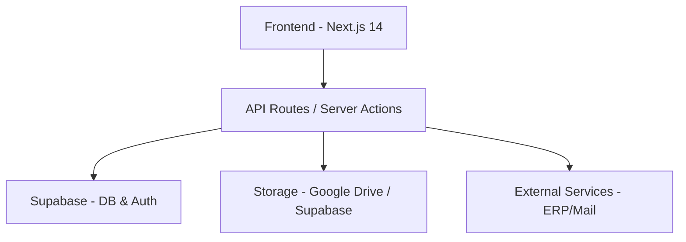

# Painel ABZ - Sistema de Gestão Empresarial

<div align="center">


[](https://nextjs.org/)
[](https://www.typescriptlang.org/)
[](https://supabase.com/)
[](https://tailwindcss.com/)
[](https://reactjs.org/)
[](#)

**Portal corporativo unificado para gestao de pessoas, processos, comunicacao interna e compliance trabalhista.**

[](CHANGELOG.md)

</div>

---

## Sobre o Projeto

O **Painel ABZ** e o nucleo digital da ABZ Group, projetado para centralizar fluxos de trabalho, facilitar a comunicacao entre colaboradores e automatizar processos administrativos complexos. O sistema abrange desde gestao financeira e avaliacoes de desempenho ate compliance governamental (e-Social) e gestao offshore de tripulantes.

---

## Arquitetura do Sistema

```
                    ┌─────────────────────────────────────┐
                    │        Next.js 14 App Router         │
                    │  (React 18 + TypeScript 5)           │
                    └──────────┬──────────────────────────┘
                               │
                    ┌──────────┴──────────────────────────┐
                    │          API Routes Layer             │
                    │  /api/auth/*  /api/admin/*  /api/*   │
                    └──────────┬──────────────────────────┘
                               │
          ┌────────────────────┼────────────────────┐
          │                    │                    │
          ▼                    ▼                    ▼
┌──────────────────┐  ┌──────────────┐  ┌──────────────────┐
│   Supabase DB     │  │  Supabase    │  │  External APIs    │
│   (PostgreSQL)    │  │  Auth/RLS    │  │  - MIO (ERP)     │
│   + 50+ tables   │  │  Storage     │  │  - e-Social (SOAP)│
│   + Views/Funcs  │  │  Realtime    │  │  - PoliWeb        │
└──────────────────┘  └──────────────┘  │  - Microsoft 365  │
                                        │  - LiveKit (Voice)│
                                        └──────────────────┘
```

### Stack Tecnologica
- **Frontend**: Next.js 14 (App Router), React 18, TypeScript 5, Tailwind CSS 3
- **Database**: Supabase (PostgreSQL) com RLS e Storage
- **Auth**: Supabase Auth + JWT customizado + WebAuthn/Passkeys
- **UI**: Radix UI, Framer Motion, React Icons, Recharts
- **OCR**: Tesseract.js + pdf-parse + pdfjs-dist
- **PDF**: jsPDF, PDFKit, React-PDF, pdf-lib
- **e-Social**: xml-crypto + node-forge + SOAP mutual TLS
- **Voice**: LiveKit WebRTC + Whisper + Piper TTS
- **IA**: GLM-4 + MS Graph API + Autonomous Agent Loop

---

## Modulos do Sistema

### Gestao de Tripulantes (Offshore) [v5.17.0]
Sistema completo de gerenciamento de tripulacao offshore:
- **Matriz de Colaboradores** - Tabela interativa com filtros por empresa, embarcacao, cargo, centro de custo, status e documentos
- **Cadastro Multi-abas** - Formulario de 7 abas (Dados Pessoais, Documentos, Endereco, Contato, Bancarios, Vinculo, e-Social)
- **Gestao de Documentos** - 14 tipos de documentos com OCR, validacao automatica e notificacoes de vencimento
- **Pipeline ASO** - Upload PDF -> OCR -> Revisao -> Geracao de evento S-2220
- **Algoritmo de Back** - Sugestao inteligente de substitutos com 8 criterios ponderados
- **Historico de Embarques** - Timeline completa com tipos, voos e estatisticas
- **Sincronizacao MIO** - Importacao/exportacao bidirecional de colaboradores, treinamentos e embarques
- **PoliWeb Scraper** - Importacao automatica de ASOs do sistema ocupacional
- **Dashboard** - Metricas em tempo real (total, embarcados, disponiveis, documentos vencendo)
- **API**: 18 endpoints REST + 13 tabelas no banco (`gt_*`)

### E-Social [v5.18.0]
Integracao completa com o sistema governamental brasileiro:
- **13 Eventos Suportados**: S-2200 a S-3000 (cadastramento, contratual, ASO, CAT, ambiental, desligamento)
- **Ciclo de Vida**: rascunho -> revisao -> aprovacao -> fila -> envio -> processamento
- **Geracao de XML**: Conforme leiaute oficial S-1.3 com headers, namespaces e IDs
- **Assinatura Digital**: XML assinado com RSA-SHA256 via xml-crypto e certificados X509
- **Transmissao SOAP**: Comunicacao mutual TLS com ambientes de producao/homologacao
- **Certificados Digitais**: Gestao de PFX A1/A3 com criptografia AES-256-CBC
- **Tabelas Oficiais**: Importacao de Tabela 27 (exames) e Tabela 50 (CBO) via CSV
- **Fatores de Risco**: 22 registros de risco ocupacional para S-2240
- **API**: 19 endpoints REST + 8 tabelas no banco (`esocial_*`)

### OCR Global [v5.18.0]
Motor de reconhecimento de documentos:
- **Formatos**: PDF (digital/escaneado), DOCX, XLSX, TXT/CSV, PNG, JPG, WebP, GIF
- **Extracao Estruturada**: CPF, RG, nome, data nascimento, CTPS, CNH, PIS/PASEP por tipo
- **OCR de ASO**: Tipo de exame, resultado (apto/inapto), CRM, dados da clinica, exames complementares
- **Pipeline**: Upload -> Tesseract.js -> extracao de campos -> salvamento estruturado
- **Fallback**: API externa configuravel para processamento em nuvem

### MIO Cache System [v5.16.0]
Camada de cache unificada para API MIO:
- **Cache em Supabase**: `mio_cache` com 4 linhas de dados + metadados
- **Pesquisa a cada 15s**: Hook React `useMIOData` com polling automatico
- **Filtro por CPF**: Usuarios veem apenas seus proprios dados
- **Rate-limit**: Minimo 10s entre sincronizacoes com o MIO
- **Integracao**: Man-Schedule, sincronizacao de colaboradores, cache de treinamentos

### Contratos & Assinaturas [v5.19.0]
- **Templates**: Modelos reutilizaveis com mapeamento de signatarios por papel
- **Campos Multi-Tipo**: Texto, checkbox, assinatura e rubrica com overlay visual de posicionamento
- **Assinatura em Lote**: Processamento de todos os campos pendentes em transacao unica
- **Validacao de Identidade**: Verificacao multi-fator (CPF, email, data de nascimento) com erro por campo
- **PDF Editor**: Insercao de campos e assinaturas em PDF com suporte multi-pagina

### Inteligencia Artificial [v5.13-v5.14]
- **Agente de Voz Real-Time**: Canal WebRTC bidirecional via LiveKit com baixa latencia
- **Agente Autonomo KPI**: Ciclo continuo de analise, monitoramento e decisoes periodicas
- **Chat com Streaming Real**: SSE com processamento recursivo de tools e persistencia
- **Base de Conhecimento**: Memoria corporativa injetada no contexto por cargo/departamento
- **Feature Toggles**: Ativacao/desativacao de ferramentas da IA por usuario
- **Pendencias por Fonte**: Teams, Emails, Calendar e Knowledge como fontes de dados

### Outros Modulos
- **Dashboard Dinamico** - Atalhos personalizados com metricas em tempo real
- **Reembolsos** - Gestao financeira com upload e geracao de relatorios PDF
- **Avaliacoes de Desempenho** - Ciclos 360 com autoavaliacao e revisao gerencial
- **Ordens de Compra** - Fluxo de aprovacao multinivel com controle de alçada
- **Recursos Humanos** - Ferias, Lista de Presenca, EPI, Ponto, Contracheque
- **Comunicacao** - Feed de Noticias, Rede Social, Chat Corporativo, Calendario
- **Academia Corporativa** - Cursos, certificados e progresso
- **Biblioteca** - Gestao de ativos (PDF, Video, Imagens, Links)

---

## Banco de Dados

### Principais Tabelas

| Schema | Modulo | Tabelas |
|--------|--------|---------|
| `gt_*` | Gestao Tripulantes | 13 tabelas (colaboradores, documentos, embarques, substituicoes, etc.) |
| `esocial_*` | E-Social | 8 tabelas (eventos, certificados, configuracoes, catalogos, etc.) |
| `mio_cache` | MIO Cache | Cache unificado com 4 tipos de dados |
| `users_unified` | Auth | Usuario central com permissoes, perfil, historico de acesso |
| `avaliacoes_desempenho` | Avaliacoes | Avaliacoes 360 com criterios e pontuacoes |
| `reimbursements` | Reembolsos | Solicitacoes de reembolso com anexos |
| `acl_*` | Permissoes | Sistema hierarquico de controle de acesso |

### Views
- `gt_vw_colaboradores_completo` - Join completo com documentos, embarques e metricas
- `gt_vw_dashboard_resumo` - Metricas agregadas do modulo de tripulantes
- `esocial_vw_dashboard` - Contagem de eventos por status
- `vw_avaliacoes_desempenho` - Avaliacoes com dados de colaboradores

### RLS (Row Level Security)
Todas as tabelas possuem RLS habilitado com politicas granulares:
- ADMIN: Acesso total a todos os modulos
- MANAGER: Acesso seletivo por modulo e feature
- USER: Acesso restrito ao proprio perfil e modulos autorizados

---

## Instalacao e Configuracao

```bash
# Clone o repositorio
git clone https://github.com/Caiolinooo/painel-abz.git

# Instale as dependencias
npm install

# Configure o ambiente
cp .env.example .env.local

# Inicie o desenvolvimento
npm run dev
```

### Configuracao do Banco de Dados

```bash
# Setup inicial
npm run db:setup

# Modulos especificos
npm run db:setup-esocial          # Bucket de certificados
npm run db:seed-esocial-riscos     # Fatores de risco
npm run db:setup-mio-cache        # Cache MIO
npm run db:setup-gestao-tripulantes # Modulo de tripulantes
npm run db:cadastro-fields        # Campos adicionais
```

> Variaveis de ambiente obrigatorias: `NEXT_PUBLIC_SUPABASE_URL`, `NEXT_PUBLIC_SUPABASE_ANON_KEY`, `SUPABASE_SERVICE_ROLE_KEY`, `JWT_SECRET`

---

## Ultimas Atualizacoes

### v5.21.0 - Hardening de Autenticacao, IA Expandida e OCR com LLM
- Autenticacao JWT obrigatoria em todas as APIs de ferias com verificacao ACL
- Novas ferramentas de IA: contracheque, contratos, ponto, lista de presenca e feedbacks
- Extracao inteligente de ASO via LLM com prioridade sobre regex
- Acesso global a solicitacoes de ferias para admins
- Corrigidos falsos positivos RG/CPF e extracao de data de nascimento no OCR

### v5.19.0 - Validacao de Identidade em Assinaturas
- Validacao multi-fator para assinaturas eletronicas (CPF, email, data de nascimento)
- Bloqueio de campos pendentes na pagina de assinatura
- Campos de identidade no perfil do usuario

### v5.18.0 - E-Social e OCR
- Modulo completo de compliance trabalhista com 13 eventos
- Integracao SOAP com certificacao digital e assinatura XML
- Motor OCR global com suporte a 7 formatos de arquivo

### v5.17.0 - Gestao de Tripulantes
- Sistema completo de gestao offshore com matriz de colaboradores
- 13 tabelas, 18 endpoints, algoritmo de back, OCR de documentos

### v5.16.0 - Cache MIO
- Cache unificado com polling de 15s e filtro por CPF
- Sincronizacao completa de usuarios, permissoes e emails

### v5.15.0 - Fundacao ACL
- Extensao do sistema de permissoes com 13 novas permissoes
- Registro de modulos e internacionalizacao (466 entradas)

---

## Changelog

Para o historico completo de todas as versoes, consulte o [CHANGELOG.md](CHANGELOG.md).

## 🏗️ Arquitetura



## 🔧 Instalação e Configuração

```bash
# Clone o repositório
git clone https://github.com/Caiolinooo/painel-abz.git

# Instale as dependências
npm install

# Configure o ambiente
cp .env.example .env.local

# Inicie o desenvolvimento
npm run dev
```

> [!IMPORTANT]
> Verifique se as variáveis de `DATABASE_URL` e `NEXT_PUBLIC_SUPABASE_URL` estão corretamente configuradas no seu `.env.local` antes de iniciar.

## 🚀 Últimas Atualizações (v5.14.0)

- **ACL Hierárquico Refatorado**: Sistema de permissões completamente reestruturado com módulos separados por categoria, novas permissões para Férias, Lista de Presença e Contratos, e hierarquia de acesso refinada por papel (ADMIN/MANAGER/USER).
- **Contratos com Templates e Campos Multi-Tipo**: Módulo de contratos agora suporta templates reutilizáveis, campos de texto, checkbox, assinatura e rubrica em lote, com editor visual de posicionamento e fluxo de assinatura em lote por signatário.
- **Streaming Real na IA Chat**: Canal de IA migrado de streaming simulado para streaming real com processamento recursivo de tools, garantindo respostas mais rápidas e precisas.
- **Expansão de Módulos do Sistema**: Adicionados módulos de Férias, Biblioteca, Ajuda, Compras, Poliweb, Man-Schedule, Chat Corporativo e Integração ERP com permissões dedicadas.
- **i18n Ampliado**: Cobertura de tradução expandida para os novos módulos, contratos, assinaturas e novos fluxos de permissões.

## 🚀 Destaques Recentes (v5.13.0)

- **Estabilização da Voz Local**: Pipeline PCM16 24kHz que reduz latência e elimina erros de decodificação no cluster local.
- **Orquestrador LiveKit v1.0**: Migração para nova API de Agentes com fallback para compatibilidade.
- **Diagnóstico WebRTC**: Telemetria ativa para monitoramento de saúde do canal de voz em tempo real.

## 🚀 Destaques Recentes (v5.12.0)

- **Agente de Voz Real-Time (LiveKit)**: Integração nativa de WebRTC de alto desempenho, garantindo processamento de voz bi-direcional para suporte interativo sem fricção.
- **Auto-Recuperação e Resiliência**: Identidades de sessão dinâmicas que previnem o ciclo de auto-kick e monitoramento avançado via `useConnectionState` para suportar oscilações de rede.
- **Otimização de Notificações (EPI)**: Restrição inteligente do envio de e-mails de estoque crítico unicamente aos IDs listados como responsáveis setoriais cadastrados.

## 🚀 Destaques Recentes (v5.11.0)

- **Expansão Internacional (i18n)**: Suporte PT-BR / EN-US completo integrado aos módulos de Contratos, Assinaturas e Reembolsos.
- **Locais e Datas Dinâmicas**: Patch avançado no motor JavaScript Date para renderização inteligente de fuso-horário global.
- **Workers Locais PDF**: Processamento de renderização de PDFs offline local (`public/workers`) para máxima privacidade e performance sem CDNs.

---

## 🚀 Versões Anteriores (Destaques)

- **Controle de Estoque (v4.10)**: Gestão de inventário e movimentações de EPIs.
- **Busca Global (v4.8)**: Sistema unificado de pesquisa.

Para o histórico completo, consulte o [CHANGELOG.md](CHANGELOG.md).

---

<p align="center">
Desenvolvido com ❤️ pela equipe ABZ Group.
</p>
# IA Pendências e Orquestração
- MVP para detecção e orquestração de pendências entre Teams, Emails, Calendar e Knowledge.
- Endpoints adicionados para cada fonte e um endpoint consolidado de overview.
- O sistema usa um orchestrator simples para decidir a fonte a ser consultada e as ações a serem executadas.
- A UI permanece inalterada; a IA responde com justificativas e planos de ação via chat.
